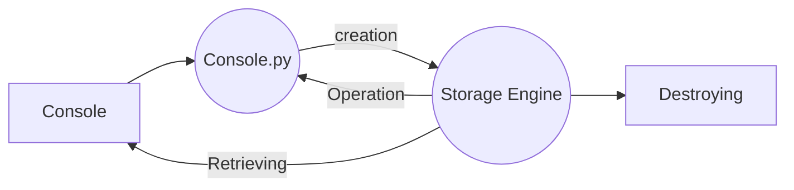

# AirBnB Clone - The Console:

**#introduction and envirenement
#advancing    
#testing
#finalizing  
#usage  
#authors**

## What I did in this project?

This is a team project aimed at creating a clone of [AirBnB](https://www.airbnb.com/). The console serves as a command interpreter to manage object abstractions and their storage.

For more detailed information about the project, refer to the [Wiki](https://github.com/ralexrivero/AirBnB_clone/wiki).

The console is designed to perform the following tasks:

### * Creating a new object

### * Retrieving an object from a file

### * Perform operations on objects

### * Destroying an object

And this will produce a flow chart:

